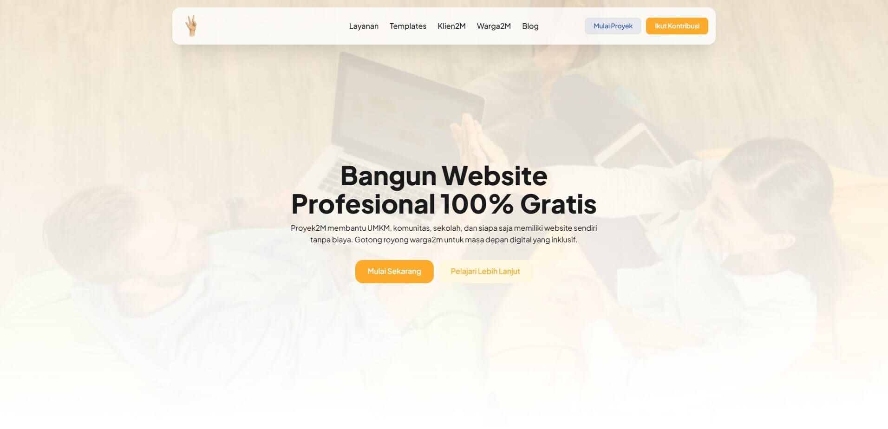

 
   

# Proyex

Selamat datang di repository **proyex** Proyek2M Website Template 🎉

Template website yang dibangun oleh **Warga2M** dengan semangat gotong royong.\
Tujuan utama kami adalah membantu UMKM, komunitas, NGO, dan organisasi lainnya agar bisa tampil di dunia digital secara gratis.

## 📖 Lisensi

Seluruh template di repository ini dirilis di bawah **Apache License 2.0 dengan Atribusi Wajib**.\
Artinya:

- Anda bebas menggunakan, memodifikasi, dan mendistribusikan
  template ini.
- **Wajib mencantumkan atribusi** kepada Proyek2M dan para
  kontributor (**Warga2M**) dalam bentuk:
    - Nama proyek **Proyek2M**
    - Nama kontributor (Warga2M) sesuai yang tercantum di NOTICE.md
    - Tautan menuju repository Proyek2M
    - Atribusi tidak boleh dihapus dalam kondisi apapun.

📌 Detail lengkap mengenai lisensi dapat dibaca di file
[LICENSE.md](./LICENSE.md) dan [NOTICE.md](./NOTICE.md).

## 🚀 Tujuan

- Membantu UMKM, NGO, komunitas, dan organisasi lain hadir secara digital.
- Menjadi wadah bagi **Warga2M** untuk membangun portofolio nyata yang bisa dilihat publik.
- Menggerakkan budaya gotong royong dalam dunia digital.

## 🙌 Kontribusi

Kami selalu terbuka bagi siapa pun yang ingin menjadi bagian dari **Warga2M**.\
Silakan cek panduan kontribusi di [CONTRIBUTING.md](./CONTRIBUTING.md).

## ❤️ Apresiasi

Jika Anda menggunakan template ini, jangan lupa memberikan atribusi sebagai bentuk apresiasi.\
Hal ini sangat berarti bagi **Warga2M**, karena membantu membangun portofolio mereka di dunia nyata.

---

Dibangun dengan cinta oleh [Warga2M Proyek2M](https://proyek2m.com/warga2m)
